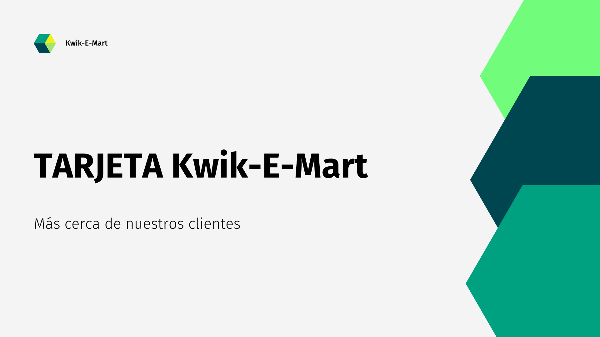
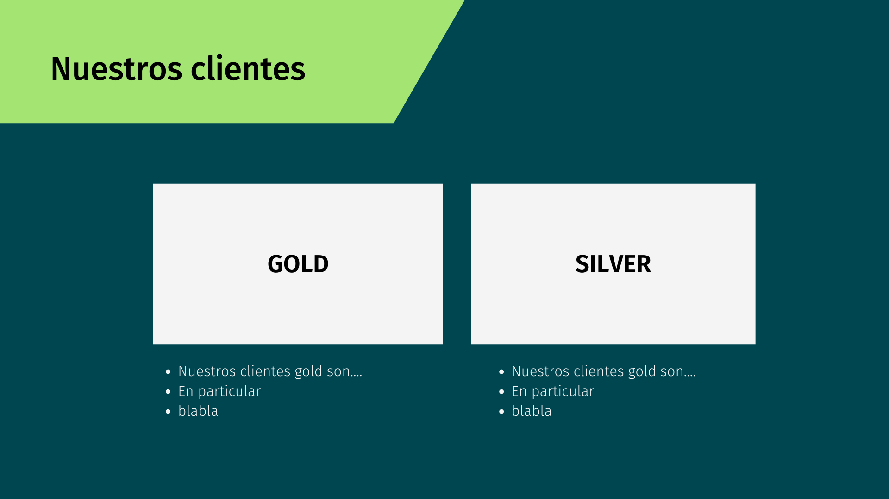
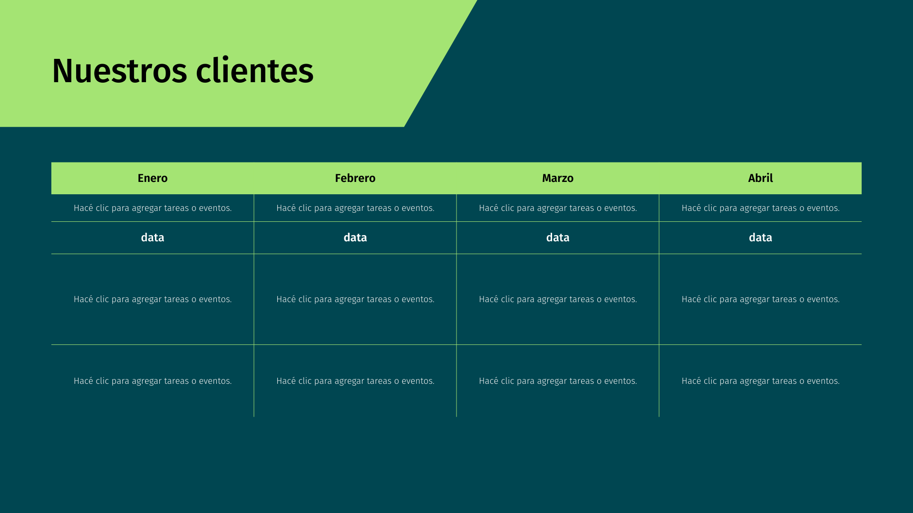

# Simulacro_2P_FI_2022_2C

## 2do Parcial FI - 2do Cuatrimestre 2022
A tener en cuenta:

* La entrega del examen se hará por este medio: tendrás que confeccionar el código adecuado para realizar cada actividad, generar los archivos correspondientes en el caso de ser necesario y pushearlos a este repo que se te generó automáticamente.

* Debés hacer un commit cada 5 min, de lo contrario tu entrega no será considerada válida.

* El tiempo recomendado de resolución será de 3 horas, pero se dará tiempo para entregar hasta el horario de finalización pautado según disposición del aula.

* Para rendir se podrán usar las computadoras disponibles de los laboratorios. Alternativamente, quien lo desee podrá traer y utilizar su propia computadora portátil.

* Durante el parcial:
 - **Solo se responderán dudas de enunciado**
 
 - Estará permitido navegar en Internet para consultar los apuntes de la cátedra.
 
 - **No estará permitido bajo ningún concepto la comunicación con otra persona salvo el o la docente a cargo, presente o no en el aula, por cualquier tipo de medio, ya sea oral u escrito**


* **Prohibido chatear**. Hacerlo será considerado una falta grave, que implicará la desaprobación automática del examen y estará sujeto a sanciones administrativas.

* Para aprobar el examen se deberá contar con al menos el 60% del mismo correcto.

* El parcial es teórico-práctico, se evalúan tanto las habilidades adquiridas en programación y en Python específicamente, como la adquisición de los conceptos teóricos. 


## Consignas

### Ejercicio N°1

Apu es el dueño de [Kwik-E-Mart](https://www.youtube.com/watch?v=7s7YR9wS8eg), una tienda que quiere hacer crecer. Está diseñando como parte de su campaña de Marketing la implementación de una tarjeta de puntos. El trabajo de su equipo será asesorar a Apu respecto las categorías en las que debe separar su clientela para el acceso a los distintos beneficios/premios.


1. Analizar los datos sobre los clientes, para obtener las características comunes que les permitan definir las categorías y beneficios a los que accederá cada cliente, según sus hábitos de consumo.

2. Construir gráficas y estadísticas sobre los hábitos de consumo de cada grupo de clientes.

<details>
  <summary>Código que te puede resultar útil</summary>

  > Bibliotecas
  ```python
  import pandas as pd
  import seaborn as sns
  from sklearn.preprocessing import StandardScaler
  from sklearn.cluster import KMeans, DBSCAN
  from sklearn.metrics import silhouette_samples, silhouette_score
  import matplotlib.pyplot as plt 
  import matplotlib.cm as cm 
  import numpy as np
  from scipy import stats
  ```

  > Gráficos (salvo silhouette)
  ```python
  # Ejemplo con el heatmap para ver los valores no nulos
  # Justo antes de realizar un gráfico, deciden el tamaño de la imagen
  plt.figure(figsize=(a,b)) # siendo a el ancho y b el largo
  no_nulls = sns.heatmap(df.isnull(), cmap='viridis')
  figure = no_nulls.get_figure()    
  figure.savefig('ruta_donde_guardar_la_imagen/imagen.png', dpi=300) # La imagen puede ser .png o .jpg

  # Si se van a realizar más de un gráfico en la misma imagen la sintaxis sería:
  plt.figure(figsize=(a,b))
  variable = sns.método1()
  variable = sns.método2()
  .
  .
  .
  variable = sns.métodoN()
  figure = variable.get_figure()    
  figure.savefig('ruta_donde_guardar_la_imagen/imagen.png', dpi=300) # La imagen puede ser .png o .jpg
  # Es decir, a la misma variable le vamos superponiendo los gráficos.
  ```
  
  > Distribución
  
  ```python
  sns.histplot(data = df, x = "columna", binwidth=10, kde = True)
  # el binwidth depende de la cantidad de datos, a mayor cantidad de datos, más grande el binwidth
  ``` 
  
  > Escalado

  ```python
  scaler = StandardScaler()
  df_escalado = scaler.fit_transform(df)
  ```
  
  > Inercias según número de grupos

  ```python
  def inercias_por_k():
    inercias = {}
    for i in range(1,11):
        kmeans = KMeans(n_clusters = i, init="random", n_init=10, max_iter=300, random_state=123457)
        kmeans.fit(df_escalado)
        inercias[i] = kmeans.inertia_
    return inercias
  ```

  > Gráfico de agrupación
  ```python
  import seaborn as sns
  colores = ["red", "green", "blue"]
  plt.figure(figsize=(8,6)) # Los valores pueden variar
  graf = sns.scatterplot(x = df_escalado[:,2], y = df_escalado[:, 3], hue = kmeans.labels_, palette = colores, alpha = 0.5)
  graf = sns.scatterplot(x = kmeans.cluster_centers_[:,2], y = kmeans.cluster_centers_[:,3], zorder = 10, palette = colores, hue = [0, 1, 2], legend = False, marker=6, s=200)
  figure = graf.get_figure()    
  figure.savefig('ruta_donde_guardar_la_imagen/imagen.png', dpi=300) # La imagen puede ser .png o .jpg
  ```

  > Silhouette

  ```python
  silhouette_avg = silhouette_score(df_escalado, kmeans.labels_)
  sample_silhouette_values = silhouette_samples(df_escalado, kmeans.labels_)

  def graficarSilhouette (k, labels, sample_silhouette_values, silhouette_avg):
    fig, ax1 = plt.subplots(1, 1, figsize=(15, 10)) # Las medidas pueden variar
    y_lower = 10
    for i in range(k):
        ith_cluster_silhouette_values = \
            sample_silhouette_values[labels == i]

        ith_cluster_silhouette_values.sort()

        size_cluster_i = ith_cluster_silhouette_values.shape[0]
        y_upper = y_lower + size_cluster_i

        color = cm.nipy_spectral(float(i) / k)
        ax1.fill_betweenx(np.arange(y_lower, y_upper),
                            0, ith_cluster_silhouette_values,
                            facecolor=color, edgecolor=color, alpha=0.7)
        ax1.text(-0.05, y_lower + 0.5 * size_cluster_i, str(i))
        y_lower = y_upper + 10

    ax1.set_title("Plot del silhouette de cada cluster")
    ax1.set_xlabel("Coeficiente de silhouette")
    ax1.set_ylabel("Etiqueta del cluster")
    ax1.axvline(x=silhouette_avg, color="red", linestyle="--")
    ax1.set_yticks([])
    plt.savefig("ruta_donde_guardar_la_imagen/imagen.png", dpi = 300) # La imagen puede ser .png o .jpg

  graficarSilhouette (k, kmeans.labels_, sample_silhouette_values, silhouette_avg)
  ```

</details>


### Ejercicio N°2
Apu nos pidió que diseñemos una aplicación web para administrar los clientes de la nueva tarjeta.
a) Construí una aplicación que exponga un end-point para el home que muestre la información general de la tarjeta y sus beneficios según la siguiente disposición de contenidos:



b) Creá un end-point que exponga los diferentes conjuntos de clientes y sus características retomando las imágenes e información necesaria del punto 1, siguiendo la disposición de contenidos que se muestra a continuación (estas pantallas son de ejemplo, podés combinarlas para mostrar todos los datos que necesites):






### Ejercicio N°3
a. El universo de Rick and Morty es complejo y bizarro, en el cual sería muy complejo poder conocer a la gente y saber donde vive si no fuera que tenemos a mano esta información, casi como una `Guia`, en la api https://rickandmortyapi.com/api/location. Esta `Guia`, además de poder obtener toda esta información, es capaz de entender el mensaje `residentes_de(lugar)`, el cual devuelve una lista de residentes del lugar que le digamos. Creá la clase `Guia` con los atributos y métodos necesarios para que cumpla con su objetivo.

b. ¿Cuál es el dominio al que estamos consultando?

c. ¿Cuántos lugares tiene almacenada la api?

d. En la arquitectura cliente-servidor ¿Qué características tiene el servidor?