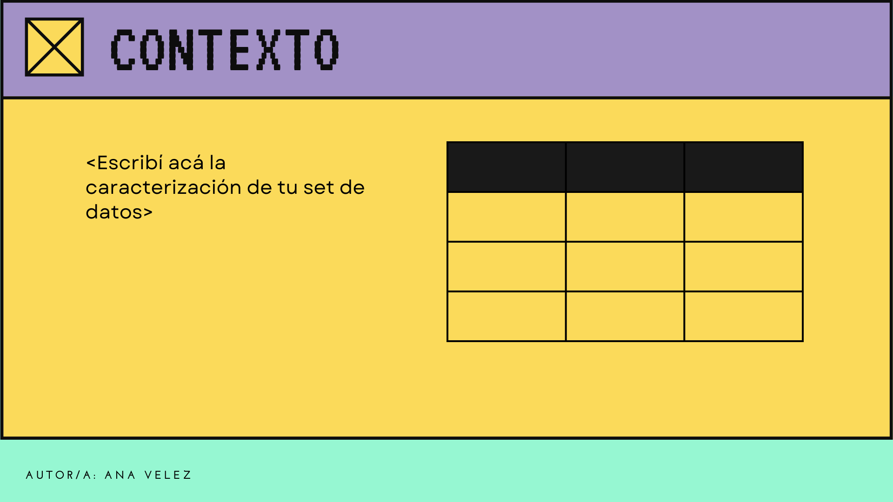
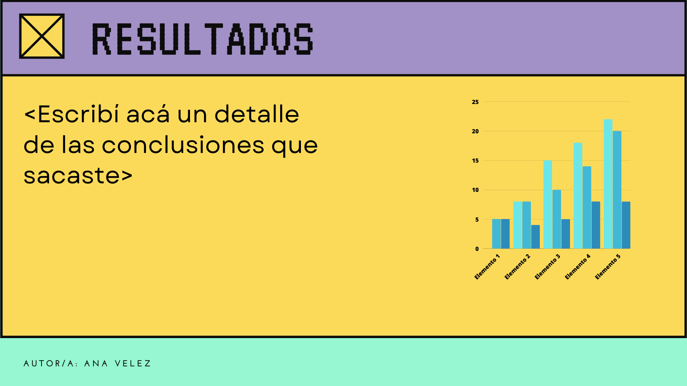
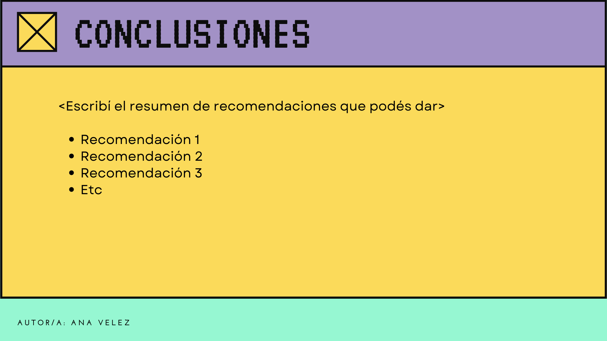

# Simulacro_2P_FI_2022_2C

## 2do Parcial FI - 1er Cuatrimestre 2022
A tener en cuenta:

* La entrega del examen se hará por este medio: tendrás que confeccionar el código adecuado para realizar cada actividad, generar los archivos correspondientes en el caso de ser necesario y pushearlos a este repo que se te generó automáticamente.

* Debés hacer un commit cada 5 min, de lo contrario tu entrega no será considerada válida.

* El tiempo recomendado de resolución será de 3 horas, pero se dará tiempo para entregar hasta el horario de finalización pautado según disposición del aula.

* Para rendir se podrán usar las computadoras disponibles de los laboratorios. Alternativamente, quien lo desee podrá traer y utilizar su propia computadora portátil.

* Durante el parcial:
 - **Solo se responderán dudas de enunciado**
 
 - Estará permitido navegar en Internet para consultar los apuntes de la cátedra.
 
 - **No estará permitido bajo ningún concepto la comunicación con otra persona salvo el o la docente a cargo, presente o no en el aula, por cualquier tipo de medio, ya sea oral u escrito**


* **Prohibido chatear**. Hacerlo será considerado una falta grave, que implicará la desaprobación automática del examen y estará sujeto a sanciones administrativas.

* Para aprobar el examen se deberá contar con al menos el 60% del mismo correcto.

* El parcial es teórico-práctico, se evalúan tanto las habilidades adquiridas en programación y en Python específicamente, como la adquisición de los conceptos teóricos. 


## Consignas

### Ejercicio N°1
Estamos por entrar en año electivo, por lo que el gobierno está acelerando las obras públicas a fin de ganar más adeptos. Para esto, sin embargo, tiene que elegir la obras a realizar para asegurarse de tener el presupuesto necesario, por lo que realiza una investigación, sabiendo de esta forma las zonas en las que se tiene que realizar la obra, la cantidad de gente que afecta esta obra, el presupuesto de cada una, el tipo (pavimentación, cloacas, etc.), tiempo de finalización (cuánto se tardaría en realizar la obra), entre otras cosas. Con esta información se van a elegir obras particulares para poder asegurarse una mayor cantidad de votos.

Dado el dataset que está dentro de la carpeta **Recursos** (*obras_publicas.csv*) ([link alternativo para descargar](https://drive.google.com/file/d/1-z94J9TH7Vr-SomcSHRjJWgRE6kKiU7-/view?usp=sharing)), realizá las siguientes consignas:

a) Cargá los datos en un data frame, inspeccionalo y caracterizalo.

b) Proponer el número de clusters (k) más apropiado y validarlo de forma gráfica.

c) Realizá el proceso de clustering con el número de clusters adecuado. ¿Fue bueno el proceso?

d) En base a los resultados, realizá una recomendación sobre en qué zonas se deberían realizar las obras.

e) ¿Qué conclusión podés sacar del gráfico del codo que se encuentra en la carpeta **Recursos**?

<details>
  <summary>Código que te puede resultar útil</summary>

  > Bibliotecas
  ```python
  import pandas as pd
  import seaborn as sns
  from sklearn.preprocessing import StandardScaler
  from sklearn.cluster import KMeans, DBSCAN
  from sklearn.metrics import silhouette_samples, silhouette_score
  import matplotlib.pyplot as plt 
  import matplotlib.cm as cm 
  import numpy as np
  from scipy import stats
  ```

  > Gráficos (salvo silhouette)
  ```python
  # Ejemplo con el heatmap para ver los valores no nulos
  # Justo antes de realizar un gráfico, deciden el tamaño de la imagen
  plt.figure(figsize=(a,b)) # siendo a el ancho y b el largo
  no_nulls = sns.heatmap(df.isnull(), cmap='viridis')
  figure = no_nulls.get_figure()    
  figure.savefig('ruta_donde_guardar_la_imagen/imagen.png', dpi=300) # La imagen puede ser .png o .jpg

  # Si se van a realizar más de un gráfico en la misma imagen la sintaxis sería:
  plt.figure(figsize=(a,b))
  variable = sns.método1()
  variable = sns.método2()
  .
  .
  .
  variable = sns.métodoN()
  figure = variable.get_figure()    
  figure.savefig('ruta_donde_guardar_la_imagen/imagen.png', dpi=300) # La imagen puede ser .png o .jpg
  # Es decir, a la misma variable le vamos superponiendo los gráficos.
  ```
  
  > Distribución
  
  ```python
  sns.histplot(data = df, x = "columna", binwidth=10, kde = True)
  # el binwidth depende de la cantidad de datos, a mayor cantidad de datos, más grande el binwidth
  ``` 
  
  > Escalado

  ```python
  scaler = StandardScaler()
  df_escalado = scaler.fit_transform(df)
  ```
  
  > Inercias según número de grupos

  ```python
  def inercias_por_k():
    inercias = {}
    for i in range(1,11):
        kmeans = KMeans(n_clusters = i, init="random", n_init=10, max_iter=300, random_state=123457)
        kmeans.fit(df_escalado)
        inercias[i] = kmeans.inertia_
    return inercias
  ```

  > Gráfico de agrupación
  ```python
  import seaborn as sns
  colores = ["red", "green", "blue"]
  plt.figure(figsize=(8,6)) # Los valores pueden variar
  graf = sns.scatterplot(x = datos_escalados[:,2], y = datos_escalados[:, 3], hue = kmeans.labels_, palette = colores, alpha = 0.5)
  graf = sns.scatterplot(x = kmeans.cluster_centers_[:,2], y = kmeans.cluster_centers_[:,3], zorder = 10, palette = colores, hue = [0, 1, 2], legend = False, marker=6, s=200)
  figure = graf.get_figure()    
  figure.savefig('ruta_donde_guardar_la_imagen/imagen.png', dpi=300) # La imagen puede ser .png o .jpg
  ```

  > Silhouette

  ```python
  silhouette_avg = silhouette_score(df_escalado, kmeans.labels_)
  sample_silhouette_values = silhouette_samples(df_escalado, kmeans.labels_)

  def graficarSilhouette (k, labels, sample_silhouette_values, silhouette_avg):
    fig, ax1 = plt.subplots(1, 1, figsize=(15, 10)) # Las medidas pueden variar
    y_lower = 10
    for i in range(k):
        ith_cluster_silhouette_values = \
            sample_silhouette_values[labels == i]

        ith_cluster_silhouette_values.sort()

        size_cluster_i = ith_cluster_silhouette_values.shape[0]
        y_upper = y_lower + size_cluster_i

        color = cm.nipy_spectral(float(i) / k)
        ax1.fill_betweenx(np.arange(y_lower, y_upper),
                            0, ith_cluster_silhouette_values,
                            facecolor=color, edgecolor=color, alpha=0.7)
        ax1.text(-0.05, y_lower + 0.5 * size_cluster_i, str(i))
        y_lower = y_upper + 10

    ax1.set_title("Plot del silhouette de cada cluster")
    ax1.set_xlabel("Coeficiente de silhouette")
    ax1.set_ylabel("Etiqueta del cluster")
    ax1.axvline(x=silhouette_avg, color="red", linestyle="--")
    ax1.set_yticks([])
    plt.savefig("ruta_donde_guardar_la_imagen/imagen.png", dpi = 300) # La imagen puede ser .png o .jpg

    graficarSilhouette (k, kmeans.labels_, sample_silhouette_values, silhouette_avg)
  ```

</details>


### Ejercicio N°2

Retomando el análisis anterior el Mayor Diamante contrató a tu consultora de software para que lo ayuden a mostrar su plan de acción para las próximas elecciones. Este se mostrará en una aplicación Web (enteramente hecha en Python), que mostrará en su `home` la información general relevada sobre las obras públicas de `Springfield` en una disposición de los contenidos similar a la siguiente:




Esta aplicación expondrá también un end-point `resultados` que mostrará los resultados de los análisis de campo hechos por los asesores del Mayor analizando las necesidades de `Springfield`, según la siguiente disposición de contenidos:



Y por último expondrá un end-point `plan_2023` que mostrará las conclusiones de los análisis y los planes de acción 2023, en caso de ganar las elecciones, siguiendo la siguiente disposición de contenidos:




### Ejercicio N°3
Una simplificación grande que podemos hacer de los pokemons es clasificarlos por el nombre, tipo/s elemental (agua, fuego, planta, etc), por los movimientos que tiene y por sus estadísticas (puntos de vida, ataque, defensa, ataque especial, defensa especial, velocidad). Teniendo en cuenta esta idea, modelá una clase llamada `Pokedex`, que entienda un mensaje `info_pokemon` que devuelve un objeto `Pokemon` de las caracteristicas del pokemon deseado, a partir de la API https://pokeapi.co/api/v2/pokemon/nombre (donde _nombre_ se corresponde con el nombre del pokemon).

Este objeto `Pokemon` debe entender los mensajes:
  - `movimientos` que devuelve una lista con los nombres de los ataques de dicho pokemon
  - `estadísticas` que devuelve sus estadísticas mostrándolas en un dataframe.

Definir los atributos y métodos necesarios.


